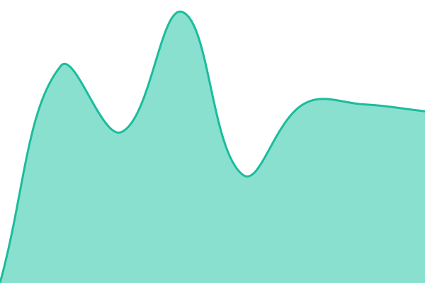
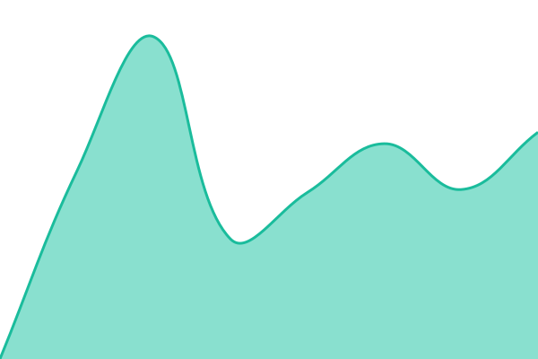

# [📈 Live Status](https://status.calgo-lab.de): <!--live status--> **🟧 Partial outage**

This repository contains the open-source uptime monitor and status page for [Cognitive Algorithms Lab](https://status.calgo-lab.de), powered by [Upptime](https://github.com/upptime/upptime).

With [Upptime](https://upptime.js.org), you can get your own unlimited and free uptime monitor and status page, powered entirely by a GitHub repository. We use [Issues](https://github.com/calgo-lab/uptime/issues) as incident reports, [Actions](https://github.com/calgo-lab/uptime/actions) as uptime monitors, and [Pages](https://status.calgo-lab.de) for the status page.

<!--start: status pages-->
<!-- This summary is generated by Upptime (https://github.com/upptime/upptime) -->
<!-- Do not edit this manually, your changes will be overwritten -->
<!-- prettier-ignore -->
| URL | Status | History | Response Time | Uptime |
| --- | ------ | ------- | ------------- | ------ |
|  [calgo-lab.de](https://calgo-lab.de) | 🟩 Up | [calgo-lab-de.yml](https://github.com/calgo-lab/uptime/commits/HEAD/history/calgo-lab-de.yml) | 

 466ms
     
 | 

<a href="https://status.calgo-lab.de/history/calgo-lab-de">100.00%</a>
    

|  [green-db.calgo-lab.de](https://green-db.calgo-lab.de) | 🟩 Up | [green-db-calgo-lab-de.yml](https://github.com/calgo-lab/uptime/commits/HEAD/history/green-db-calgo-lab-de.yml) | 

 1513ms
     
 | 

<a href="https://status.calgo-lab.de/history/green-db-calgo-lab-de">100.00%</a>
    

|  [product-classification.demo.calgo-lab.de](https://product-classification.demo.calgo-lab.de) | 🟥 Down | [product-classification-demo-calgo-lab-de.yml](https://github.com/calgo-lab/uptime/commits/HEAD/history/product-classification-demo-calgo-lab-de.yml) | 

 701ms
     
 | 

<a href="https://status.calgo-lab.de/history/product-classification-demo-calgo-lab-de">23.49%</a>
    

<!--end: status pages-->

[**Visit our status website →**](https://status.calgo-lab.de)

## 📄 License

- Powered by: [Upptime](https://github.com/upptime/upptime)
- Code: [MIT](./LICENSE) © [Cognitive Algorithms Lab](https://status.calgo-lab.de)
- Data in the `./history` directory: [Open Database License](https://opendatacommons.org/licenses/odbl/1-0/)
